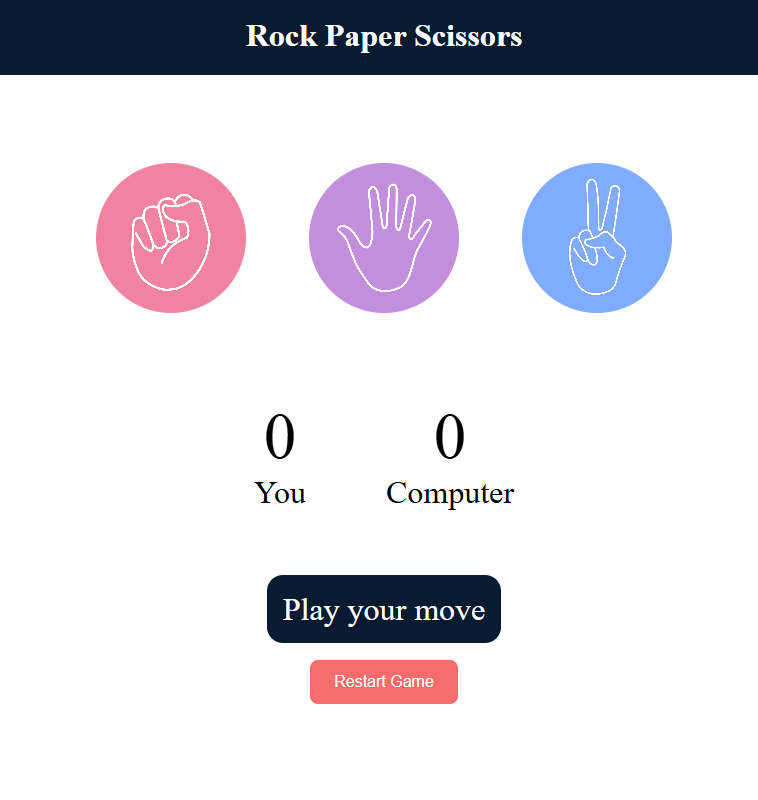

# 🪨 Rock Paper Scissors Game✂️

An interactive Rock Paper Scissors game built using **HTML**, **CSS**, and **JavaScript**.

## 📸 Preview

## 🎮 Features

- 🖱️ Click-based user interaction
- 🤖 Random computer move generation
- 🏆 Live score tracking (You vs Computer)
- 📢 Real-time result messages (Win, Lose, Draw)
- ✨ Clean and responsive design

## 🛠️ Technologies Used

- HTML5
- CSS3
- JavaScript (Vanilla)

## 🚀 How to Play

1. Click on **Rock**, **Paper**, or **Scissors**.
2. The computer randomly makes a move.
3. The winner is displayed, and scores are updated.

## 📂 Project Structure
rock-paper-scissors-game/
│
├── index.html # Main game page
├── style.css # Styling
├── app.js # Game logic
└── images/ # Game icons
├── rock.png
├── paper.png
└── scissors.png

## 💡 How to Run Locally

1. Clone this repository:
git clone https://github.com/TeresaFernando/rock-paper-scissors-game.git

2. Open the `index.html` file in your browser.

✅ No installation required — it's fully front-end based!

## 🔗 View on GitHub

[Click here to view the repository](https://github.com/TeresaFernando/rock-paper-scissors-game)

---

### 🙋‍♀️ About the Developer

**Teresa Fernando**  
💻 Passionate IT Graduate & Aspiring Web Developer  
🔗 [LinkedIn](https://www.linkedin.com/in/teresa-kennady-fernando/)

## License

This project is licensed under the [MIT License](LICENSE).

